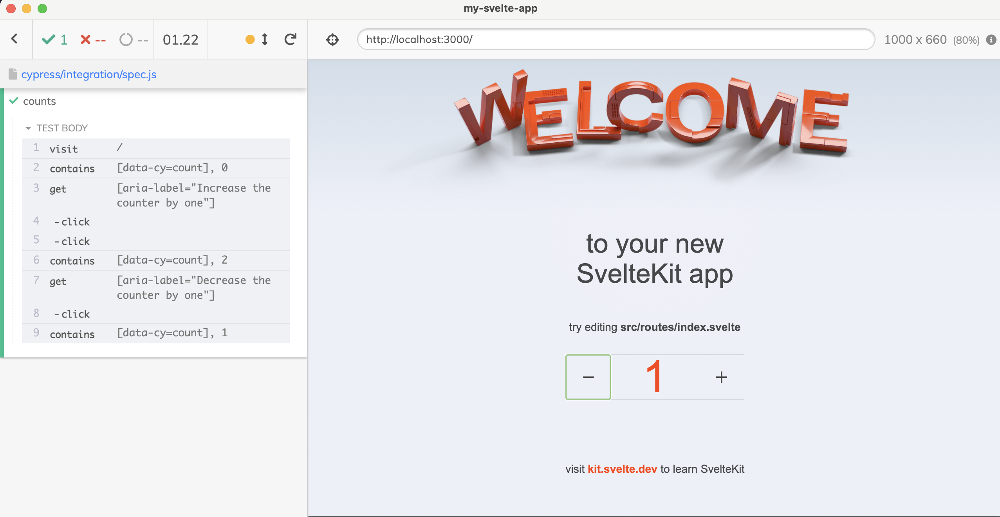

# my-svelte-app

> Example [Svelte Kit app](https://kit.svelte.dev/) with [Cypress](https://cypress.io) tests



## Install and open Cypress

```
$ npm install
$ npm run dev
# starts the application
# opens Cypress Test Runner
```
